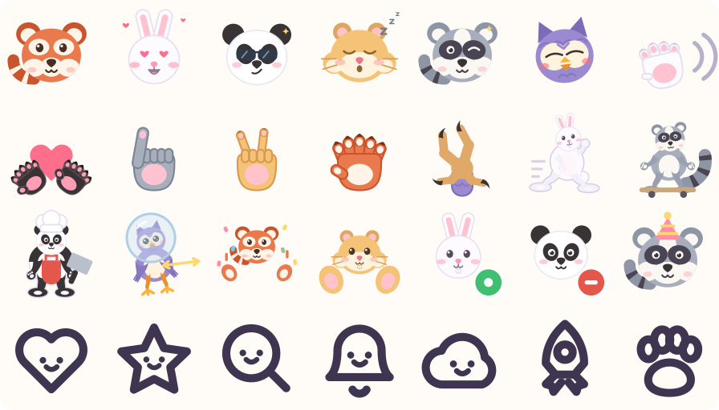
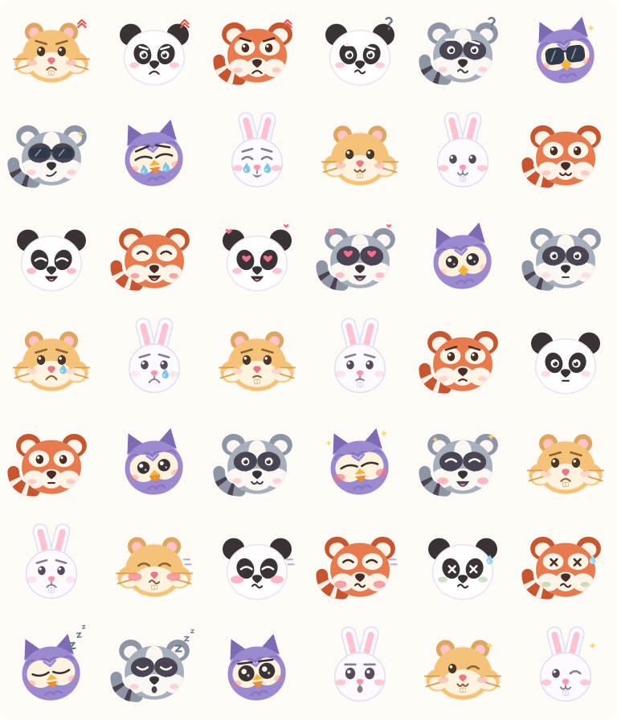
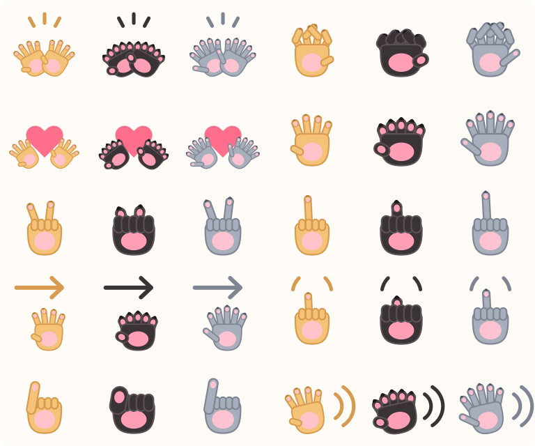
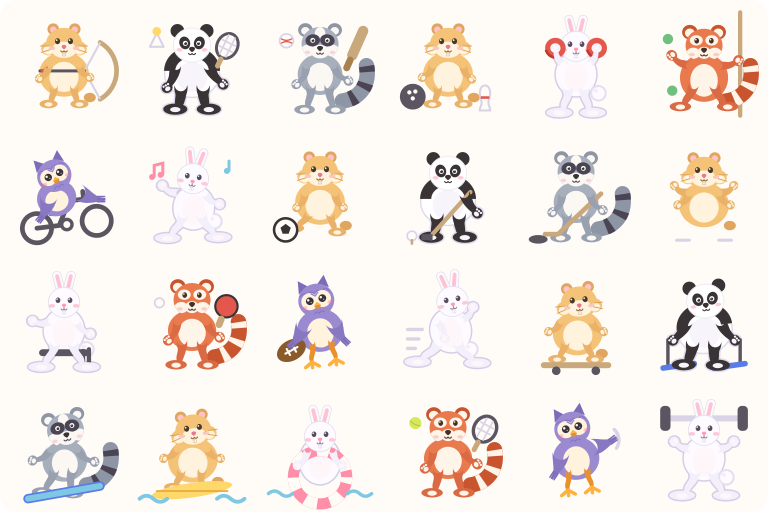
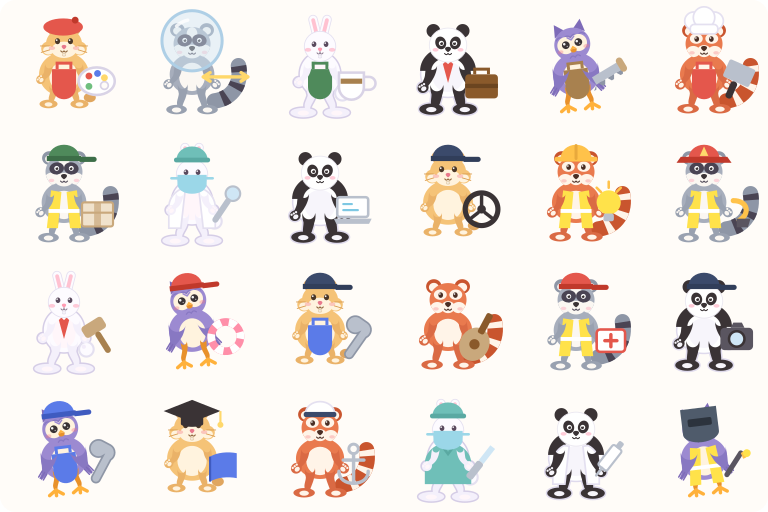
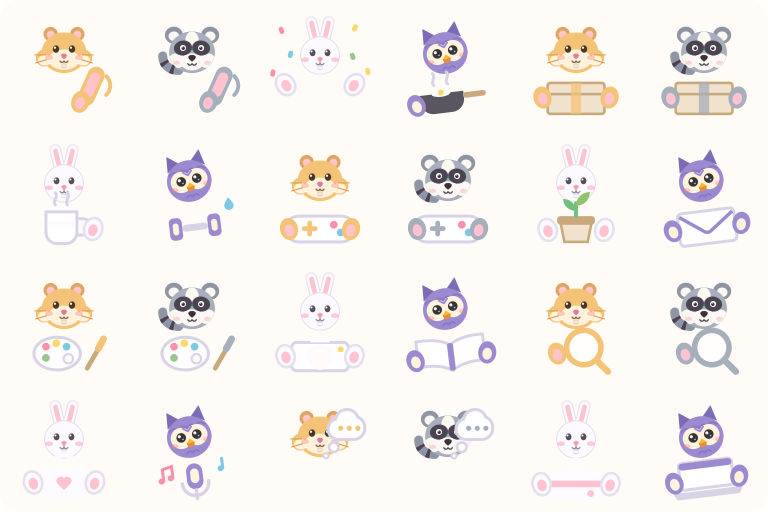
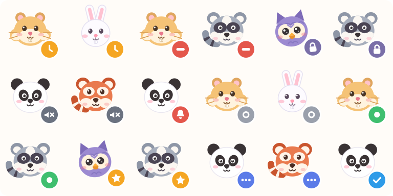
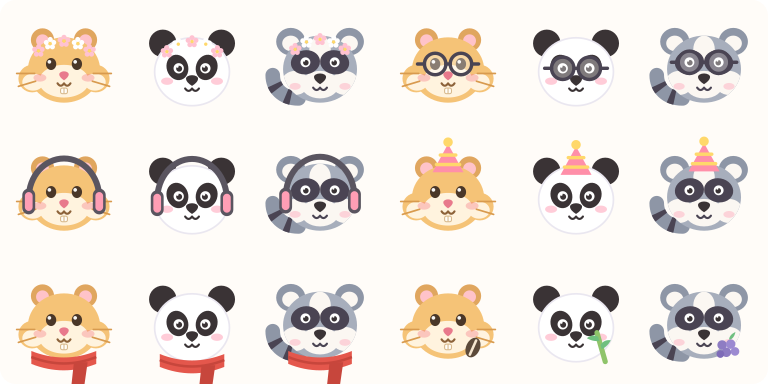
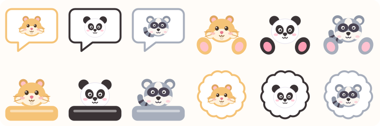
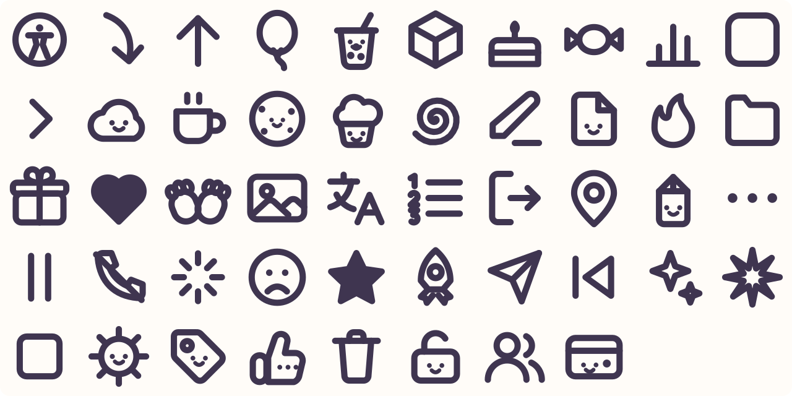

# Kawaii Icon Pack

**Six kawaii characters, drawn for every mood and every state** — plus a companion
set of plain UI icons for the interface around them. 1119 icons, zero dependencies.

<p align="center">
  
</p>

```
ui/          251 icons   kawaii UI set — faces, paws, deco, food, doodles
jobs/        258 icons   43 occupations, drawn for each character
bodies/      198 icons   33 full-body poses and sports, each character
characters/  114 faces   6 animals x 14 expressions + a 5-step rating scale
actions/     108 icons   the characters doing things — 18 verbs each
paws/         60 icons   every gesture per character (wing and talon for the owl)
status/       60 avatars every character x every status
extras/       36 icons   accessories, plus one signature snack per character
frames/       24 icons   characters composed into bubbles, stickers, ledges, hugs
badges/       10 badges  status dots, character-independent
```

## Preview

**[Browse all 1119 icons →](https://hatip5656.github.io/kawaii-icon-pack/)** — searchable,
click any icon to copy its code.

The same page is committed as [`preview/index.html`](preview/index.html) — one
self-contained file with every icon inlined. Clone or download it and open it
straight in a browser: no server, no build step, nothing to install. (GitHub
renders HTML files as source, so use the link above or open your own copy.)

<details>
<summary><b>Characters</b> — 114 faces, 14 expressions and a rating scale</summary>
<p></p>
</details>

<details>
<summary><b>Hand gestures</b> — 60 paws, wings and talons</summary>
<p></p>
</details>

<details>
<summary><b>Full bodies</b> — 198 poses and sports</summary>
<p></p>
</details>

<details>
<summary><b>Occupations</b> — 258 icons</summary>
<p></p>
</details>

<details>
<summary><b>Actions</b> — 108 verbs</summary>
<p></p>
</details>

<details>
<summary><b>Status avatars and badges</b> — 60 + 10</summary>
<p></p>
<p></p>
</details>

<details>
<summary><b>Accessories and compositions</b> — 36 + 24</summary>
<p></p>
<p></p>
</details>

<details>
<summary><b>UI icons</b> — 251 line glyphs, currentColor</summary>
<p></p>
</details>

The sheets above are samples spread across each layer. The link goes to all of them.

**Characters:** red panda · rabbit · panda · hamster · raccoon · owl

Each is drawn from its own anatomy rather than being a recolour of one face:

| Character | Species tell |
| --- | --- |
| Red panda | ringed tail curling in from the lower left, cream face mask, white-rimmed ears |
| Rabbit | narrow face, long ears, the cleft upper lip, buck teeth |
| Panda | round chunky skull, tilted eye patches, black ears |
| Hamster | cheek pouches that bulge past the head silhouette, whiskers, tiny ears |
| Owl | the head tilt, brow feathers between the facial discs, beak instead of a mouth |

The owl's tilt is applied to the whole drawing, so every layer — expression,
accessory, badge — turns with it.

Zero dependencies. Open `preview/index.html` to browse everything and click any icon
to copy its code.

## Install

```bash
npm install kawaii-icon-pack
```

## Icon codes

Every icon has one code, and that code is the filename, the export name and the
sprite id. Nothing to translate between.

| Layer | Pattern | Examples |
| --- | --- | --- |
| Character | `<expression>_<animal>` | `happy_rabbit`, `sleepy_owl`, `love_red_panda` |
| Rating face | `rate_<1-5>_<animal>` | `rate_1_panda`, `rate_5_hamster` |
| Paw gesture | `<gesture>_<animal>` | `wave_rabbit`, `thumbs_up_panda`, `peace_owl` |
| Composition | `<frame>_<animal>` | `bubble_rabbit`, `sticker_panda`, `peek_owl`, `hug_hamster` |
| Accessory | `<accessory>_<animal>` | `party_hat_owl`, `glasses_panda`, `scarf_rabbit` |
| Snack | `snack_<animal>` | `snack_panda` (bamboo), `snack_rabbit` (carrot) |
| Action | `<verb>_<animal>` | `reading_owl`, `shopping_rabbit`, `celebrating_panda` |
| Body pose | `<pose>_<animal>` | `tennis_owl`, `skiing_panda`, `boxing_raccoon` |
| Occupation | `<job>_<animal>` | `doctor_rabbit`, `chef_panda`, `pilot_owl` |
| Status avatar | `<status>_<animal>` | `online_rabbit`, `busy_owl`, `typing_panda` |
| Badge | `badge_<status>` | `badge_online`, `badge_verified` |
| UI | `<name>` | `search`, `cart_add`, `chevron_down`, `settings` |

**Animals:** `red_panda` · `rabbit` · `panda` · `hamster` · `owl`

**Expressions:** happy · neutral · sad · crying · angry · surprised · sleepy · love ·
wink · laughing · cool · confused · shy · sick

**Statuses:** online · away · busy · offline · typing · notification · muted ·
verified · locked · star

**Gestures:** high_five · wave · thumbs_up · point · tap · grab · clap · peace ·
heart_hands · swipe — drawn in colour per character, and as monochrome line icons in
the UI layer.

At 256 a paw is big enough to show how the animal is actually built, so each species
gets its own hand rather than one silhouette recoloured six times:

| | Hand |
| --- | --- |
| Red panda | 5 digits, semi-retractable claws, and the false thumb — an enlarged wrist bone — it grips bamboo with |
| Panda | 5 digits plus the famous pseudo-thumb, heavy blunt claws |
| Raccoon | 5 long dexterous fingers, the longest in the pack, fine claws |
| Hamster | 4 slender fingers and a thumb stub, small pale nails |
| Rabbit | 4 furred digits, blunt non-retractable claws, narrow paw |
| Owl | no hands at all — see below |

Extended digits sit behind the palm so their roots disappear into it; folded ones sit
in front, the way knuckles crown a real fist. That ordering is what makes `peace`,
`point` and `thumbs_up` read as gestures instead of mittens.

**The owl is a bird, so it does not get a paw.** Anything you would do with an open
hand — `high_five`, `wave`, `swipe`, `clap`, `peace`, `heart_hands` — is a **wing**:
coverts under a fan of overlapping primaries with rounded tips (owls have rounded
wingtips, not pointed ones) and the comb-like serrated leading edge that makes owl
flight silent. Anything involving grip or a pointed digit — `grab`, `point`, `tap` —
is a **talon**: a zygodactyl foot, two toes forward and two back, on a feathered
tarsus, with hooked black claws. Its `thumbs_up` raises the **alula**, the small
winglet on the leading edge that is the only thumb a bird has.

**Accessories:** party_hat · glasses · headphones · scarf · flower_crown — anchored
per animal, because the heads differ. The rabbit's ears own the top of the canvas, so
its party hat perches to one side; the panda's eyes sit close together, so its glasses
are narrower.

**Snacks:** red panda → berry · rabbit → carrot · panda → bamboo · hamster → seed ·
owl → acorn.

**Verbs:** reading · working · calling · searching · shopping · celebrating ·
thinking · drinking · delivering · painting · mailing · gardening — face above, prop
below, paws gripping it.

**Body poses (33).** Everyday: standing · sitting · waving · running · jumping ·
dancing · yoga · climbing.

Sports: tennis · football · basketball · baseball · volleyball · rugby · cricket ·
golf · ping_pong · badminton · bowling · hockey · boxing · karate · weightlifting ·
archery · swimming · surfing · rowing · fishing · cycling · skateboarding ·
ice_skating · skiing · snowboarding.

The body is assembled from parts — torso, belly, two arms, two legs, head — so a pose
is a set of limb angles, not a new drawing.

**Limbs are a skeleton.** Each species has a bone chain with real lengths and widths —
forelimb is humerus + radius, hindlimb is femur + tibia + metatarsus — and limbs are
built by forward kinematics: the first angle is absolute, each later one is relative to
its parent bone, so a joint is a joint and not a curve. Bones are rooted at anatomical
shoulders and hips derived from the torso, never placed by hand.

**Limbs are drawn as silhouettes, not strokes.** The joint polyline is smoothed with a
Catmull-Rom spline and wrapped in a closed outline whose width is sampled along its
length: thick at the proximal bone, tapering to the wrist, with a slight swell over the
muscle. That is what stops a limb reading as a pipe.

The owl's wing is the same machinery with a wing profile — humerus, radius, manus,
broad at the shoulder and narrowing to three primary feathers at the tip. All forelimbs — wings included — are
painted *after* the torso rather than behind it. Drawn in limb order a wide-bodied
animal hides its own arm behind its chest, leaving the paw floating in space.

Where a pose puts a prop in the paw, the wrist position is tracked as the limb is
built and the prop is placed there, rather than at a coordinate guessed in advance.

**The body is one silhouette.** Every part sends its keyline to a pass painted
underneath the whole figure, so interior keylines are covered by the other parts' fills
and only a single continuous contour survives. Drawing each part with its own outline is
what makes a character read as assembled stickers. Limb tones are a shade of the torso
rather than a separate colour, for the same reason — a limb is shaded, not a different
animal. The panda is the exception: its black limbs are species marking, not shading.

The ratios *are* the morphology. A rabbit's tibia is nearly as long as its femur with a
long metatarsus again, which is what produces a hare's crouch; a panda's bones are short
and thick and barely flex. Resting knee flex is 42% of the species maximum, so a standing
animal stands and the crouch is reserved for running and jumping.

A pose that places a limb above the shoulder is read as raised, and the humerus is
aimed at that point rather than using the old tilt.

Each species has its own build, not one shape in six colours:

| Character | Build |
| --- | --- |
| Red panda | compact torso, ringed tail at full size |
| Rabbit | narrow chest, big hind haunches, long feet, cotton-puff tail |
| Panda | barrel torso, thick limbs, the black shoulder band that joins its forelimbs |
| Hamster | almost spherical, stubby legs, small tail nub |
| Raccoon | leaner torso, long dexterous fingers, ringed tail |
| Owl | wings and talons — see below |

The owl is drawn as a bird throughout: **wings** instead of arms — broad at the
shoulder, tapering to feathered tips — and **scaly amber legs with three-toed talons**
instead of padded feet. That applies to all 33 poses and all 43 occupations, not just
the standing pose. Limbs carry species colour: the panda's
are black, the owl's read as folded wings, and the red panda and raccoon keep their
ringed tails at full size.

**Occupations (43).** Healthcare: doctor · nurse · surgeon · dentist · vet ·
pharmacist. Emergency: firefighter · police · paramedic · lifeguard. Education and
science: teacher · professor · scientist · librarian · astronaut. Food: chef · baker ·
barista · waiter · butcher · farmer. Trades: builder · carpenter · plumber ·
electrician · mechanic · decorator · welder · cleaner. Creative and office: artist ·
musician · photographer · writer · developer · lawyer · judge · businessperson ·
detective · magician. Transport: pilot · sailor · driver · courier.

Each is a row of data — backdrop, headwear, uniform, tool — so a new job costs one
line. The backdrop layer draws behind the whole body (the teacher's blackboard).

**Compositions:** `bubble` speech bubble · `sticker` scalloped sticker · `peek`
peeking over a ledge · `hug` face with two paws — each in the character's own colour.

**Rating scale:** `rate_1` terrible · `rate_2` poor · `rate_3` okay · `rate_4` good ·
`rate_5` great — drawn for every animal, and as plain circle faces in the UI layer.

## Usage

```js
import { happy_rabbit, online_owl, character, statusIcon, badge, icon, dataUri }
  from "kawaii-icon-pack";

avatar.innerHTML = happy_rabbit;        // named export — tree-shakeable
avatar.innerHTML = icon("online_owl");  // or look it up by code

character("rabbit", "sleepy");          // -> sleepy_rabbit
statusIcon("owl", "busy");              // -> busy_owl
badge("online");                        // -> badge_online

img.src = dataUri(happy_rabbit);        // for  or CSS url()
```

Every character has all 14 expressions, so a single component can drive the mood:

```js
const mood = unread ? "surprised" : idle ? "sleepy" : "happy";
avatar.innerHTML = character("panda", mood);
```

A feedback widget is the same trick with the rating scale:

```jsx
{[1, 2, 3, 4, 5].map((n) => (
  <button key={n} onClick={() => rate(n)}>
    <Icon name={`rate_${n}_rabbit`} size={56} />
  </button>
))}
```

### React

```jsx
import { Icon } from "kawaii-icon-pack/react";

<Icon name="happy_rabbit" size={64} />
<Icon name="busy_owl" size={40} />
<Icon name="cart_add" size={20} />
```

UI icons inherit the surrounding text colour, so they theme themselves:

```jsx
<button className="text-red-600">
  <Icon name="trash" /> Delete
</button>
```

### Kawaii UI icons

The UI layer is not a neutral icon set bolted on — it is drawn to the same motto.

- **Objects have faces.** 26 of them — `folder`, `mail`, `cloud`, `cart`, `bell`,
  `search`, `settings`, `trash`, `truck`, `lock` — carry two dot eyes and a smile,
  drawn in `currentColor` like the rest of the path.
- **Hands are paws.** The gesture family is `thumbs_up` · `thumbs_down` · `wave` ·
  `point` · `tap` · `grab` · `clap` · `peace` · `heart_hands` · `swipe`, plus the
  `paw` brand glyph. No human hands anywhere in the pack. The UI layer keeps the
  simple 24px silhouette — claws and finger pads only exist in the 256 colour set,
  where there is room for them.
- **Chunkier line.** 2.2px stroke with round caps, so the set reads soft next to the
  characters instead of clinical.
- **A whole cute vocabulary** beyond the functional set — the things a cute site is
  actually built from:

| Group | Icons |
| --- | --- |
| Deco & sparkle (12) | `star_burst` `twinkle` `confetti` `party_popper` `bow` `balloon` `gift` `crown` `gem` `rainbow` `heart_pop` `wand` |
| Emote marks (10) | `blush` `sweat_drop` `anger_vein` `zzz` `music_note` `spark_lines` `heartbeat` `dizzy` `pop` `exclaim` |
| Food & drink (12) | `cupcake` `donut` `ice_cream` `cookie` `cake` `candy` `lollipop` `boba` `coffee` `teapot` `milk` `strawberry` |
| Nature (10) | `sun_face` `moon_face` `flower` `tulip` `leaf` `sprout` `mushroom` `snowflake` `star_night` `cactus` |
| Bubbles & frames (6) | `bubble_cloud` `bubble_heart` `bubble_star` `sticker` `ticket` `frame_cloud` |
| Doodle arrows (6) | `arrow_curly_right` `arrow_curly_left` `arrow_loop` `arrow_doodle_down` `squiggle` `divider_hearts` |
| Rating faces (5) | `rate_1` … `rate_5` — a ready-made feedback scale, sad to delighted |
| Paw extras (3) | `paw_prints` `paw_heart` `high_five` |

The emote marks are the sprinkles: scatter `sparkles`, `blush` or `zzz` next to a
heading the way a sticker sheet would.

```jsx
<Icon name="wave" size={24} />        // a paw waving
<Icon name="folder" size={24} />      // a folder with a face
<Icon name="folder_plain" size={16} />// the same folder, no face
```

**Faces need ~20px.** Below that the eyes turn to mush, so all 47 faced icons ship a
`_plain` twin with the face removed — same silhouette, same code plus `_plain`. Use
the faced version everywhere you have room, and `_plain` for 16px table rows and
dense chrome.

`icons.json` also carries `ui_groups`, so you can build a grouped picker without
hardcoding the taxonomy.

### Sprite

```html
<svg><use href="/kawaii-icon-pack/sprite-ui.svg#search"/></svg>
```

`sprite-ui.svg` is 35 KB for all 132 UI icons; `sprite-characters.svg` holds the
animals.

### Plain files

```html

```

```css
.icon-search { background: url("kawaii-icon-pack/svg/ui/search.svg") center / contain no-repeat; }
```

### TypeScript

`Animal`, `Expression`, `Status` and `UiName` are string unions, and `IconName` is
built from them with template literal types — so `icon("sleepy_rabbit")` type-checks
and `icon("sleepy_walrus")` does not.

## The two contracts

They are deliberately different. Mixing them is what makes icon packs unthemeable.

| | Character layer | UI layer |
| --- | --- | --- |
| Canvas | 256 × 256 (badges 96 × 96) | 24 × 24 |
| Colour | fixed multicolour palette | `currentColor` only |
| Personality | full character | faces on objects, paws for hands |
| Stroke | n/a — flat fills | 2.2px, round caps and joins |
| Sizing | readable to 24px | 20px faced, 16px `_plain` |
| Use | avatars, empty states, mascots | buttons, nav, forms |

### Character palette

| Animal | Primary | Secondary | Accent |
| --- | --- | --- | --- |
| Red panda | `#E97A4E` | `#FFF4E8` | `#C9552E` |
| Hamster | `#F5C377` | `#FFF3DE` | `#E8798C` |
| Rabbit | `#FDFBFF` | `#FFC2D1` | `#E4E0F0` |
| Panda | `#FFFFFF` | `#3A3335` | `#FF8FA9` |
| Owl | `#9C8AD1` | `#FFF3DE` | `#FFB13B` |

Shared ink `#3A3335` / `#4A2E24`, blush `#F4737F` / `#FF8FA9`, shades `#2F3A4A`.

## Accessibility

Every file has `role="img"` and a `<title>`. Inline several in one document and you
must namespace the `id` attributes — `scripts/contact_sheet.py` has a short
`uniquify()` that does it.

The `spinner` icon is a static 3/4 ring; animate it yourself:

```css
.spinner { animation: spin 1s linear infinite; }
@keyframes spin { to { transform: rotate(360deg); } }
```

## Development

Icons are **generated**. Edit the scripts, never `svg/`.

```bash
npm run build                                # icons + dist + preview
python3 scripts/build_icons.py               # SVGs only
python3 scripts/build_icons.py rabbit sleepy away   # print one composed icon
python3 scripts/contact_sheet.py ui          # all UI icons in one grid SVG
python3 scripts/contact_sheet.py characters  # all 70 faces
python3 scripts/contact_sheet.py status      # badges + status avatars
```

- `scripts/ui_icons.py` — UI path data, plus the `FACES` map and paw helpers
- `scripts/build_icons.py` — animal bases, expressions, badges, frame compositions
- `scripts/animal_paws.py` — the coloured paw/wing gesture silhouettes
- `scripts/animal_extras.py` — accessories, per-animal anchors, signature snacks
- `scripts/animal_actions.py` — verb props and the paws that grip them
- `scripts/animal_bodies.py` — full-body poses and per-species limb colours
- `scripts/build_js.py` — dist entry points, sprites, React wrapper
- `scripts/build_preview.py` — the gallery
- `scripts/contact_sheet.py` — QA grid; render it before shipping artwork changes

Adding a UI icon is one entry in `UI_ICONS`. Adding an expression is one entry in
`expressions()` and it lands on all five animals. The build fails if any icon code
collides with a JavaScript keyword or duplicates another.

`npm run build` needs **python3**. It runs on `prepublishOnly`, never on install, so
consumers don't need it.

## Roadmap

See [SPEC.md](SPEC.md) for the full plan — 302 UI icons, 42 expressions, 24 badges,
16 empty-state scenes, and the remaining distribution formats.

## Before publishing

- [x] Name checked free on npm (`npm view kawaii-icon-pack` → 404)
- [ ] Fill in `author` in `package.json` and the copyright holder in `LICENSE`
- [ ] Add a `repository` field
- [ ] `npm pack --dry-run`
